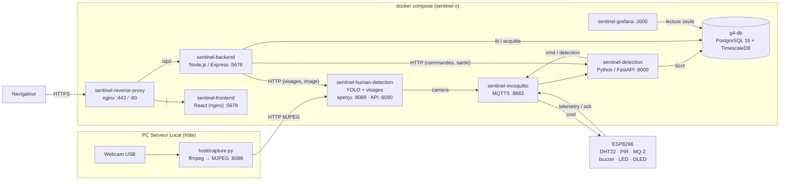

# Sentinel-X

Boîtier de surveillance autonome (Edge Node) : capteurs ESP8266, caméra USB avec IA de détection
et reconnaissance faciale, détection d'incidents en temps réel et dashboard sécurisé, le tout
orchestré par un seul `docker-compose.yml`.

Dépôt parent de l'organisation [Sentinel-X-G4](https://github.com/Sentinel-X-G4) : il regroupe les
composants en sous-modules Git et contient la seule configuration Docker Compose du projet.

---

## Sommaire

- [Présentation](#présentation)
- [Architecture et stack](#architecture-et-stack)
- [Structure du dépôt](#structure-du-dépôt)
- [Prérequis](#prérequis)
- [Installation et configuration](#installation-et-configuration)
- [Lancement](#lancement)
- [Utilisation](#utilisation)
- [Déploiement](#déploiement)
- [Sécurité](#sécurité)
- [Données et intégrations](#données-et-intégrations)
- [Dépannage](#dépannage)

---

## Présentation

**Contexte.** Projet du Workshop EPSI Mastère 1 (octobre 2026), « Mission Sentinel-X ». Le scénario :
surveiller des micro-centrales isolées contre trois menaces, à savoir les intrusions physiques, les
risques environnementaux (gaz, incendie, inondation) et les attaques réseau. Tout le calcul tourne
sur un **PC Serveur Local** qui sert aussi de point d'accès Wi-Fi au boîtier.

**Fonctionnalités**

- Mesures en continu de l'ESP8266 (température, humidité, mouvement PIR, gaz MQ-2), envoyées environ 5 fois par seconde en MQTTS.
- Détection de personnes (YOLO) et reconnaissance des visages autorisés (YuNet + SFace) sur une webcam USB.
- Détection de quatre types d'alerte : `presence`, `fuite_gaz`, `feu` et `inondation`. Elle s'appuie sur des modèles Orange Data Mining, ou sur des règles en repli, avec un filet de sécurité gaz toujours actif.
- Alarme physique automatique sur l'ESP (buzzer, LED, écran OLED), pilotable aussi depuis le dashboard.
- Dashboard React avec rôles (`user`, `admin`, `superadmin`) et connexion par mot de passe ou par visage.
- Historique en PostgreSQL/TimescaleDB, supervision dans Grafana.
- Enregistrement de sessions étiquetées pour entraîner de nouveaux modèles Orange.

---

## Architecture et stack



### Flux principaux

1. **Mesures** : l'ESP publie sur `sentinelx/esp01/telemetry`. Le service de détection calcule des features sur des fenêtres de 2 s et de 60 s, puis applique le modèle. Il lisse les résultats et écrit en base les mesures, les fenêtres, les prédictions et les alertes.
2. **Caméra** : `capture.py` (sur l'hôte) diffuse la webcam en MJPEG. Le détecteur publie `{person, identity, names, faces}` sur `sentinelx/esp01/camera`, et le service de détection enregistre ce dernier état dans `detection.camera_state`.
3. **Alarme** : quand une alerte s'active, le service de détection publie `alert on` et un message à l'écran sur `sentinelx/esp01/cmd`. L'ESP répond sur `.../ack`.
4. **Dashboard** : le navigateur interroge `GET /api/v1/overview` toutes les 0,5 s et reçoit l'image de la caméra par un flux MJPEG continu (`/api/v1/camera/stream`), via le reverse proxy. Le backend lit la base et relaie en HTTP vers la détection et la vision. **Il ne se connecte pas à MQTT** et n'utilise pas de WebSocket.

### Stack et versions

| Composant | Technologie | Version (source) |
|---|---|---|
| Firmware | C++ Arduino, PlatformIO, carte `nodemcuv2` (ESP-12E) | `espressif8266` ; libs : PubSubClient ^2.8, ArduinoJson ^7.0.0, DHT ^1.4.6, Adafruit SSD1306 ^2.5.9 ([platformio.ini](services/software/platformio.ini)) |
| Broker | Eclipse Mosquitto | `eclipse-mosquitto:2` |
| Reverse proxy | nginx | `nginx:1.27-alpine` |
| Service de détection | Python 3.12, FastAPI, aiomqtt, SQLAlchemy async, Orange | orange3 3.40.0, scikit-learn 1.5.2 ([Dockerfile](services/backend-iot-alerts/detection-service/Dockerfile)) |
| IA vision | Python 3.12, Ultralytics YOLO, OpenCV, paho-mqtt | torch 2.8.0, ultralytics 8.3.210, opencv-python-headless 4.12.0.88, modèle `yolo11n.pt` |
| Backend API | Node.js, Express, pg, helmet, express-rate-limit | `node:20-alpine`, express ^5.2.1 |
| Frontend | React, React Router, Vite | react ^19, vite ^7, servi par `nginxinc/nginx-unprivileged:alpine` |
| Base | PostgreSQL 16 + TimescaleDB | `timescale/timescaledb:latest-pg16` |
| Supervision | Grafana OSS | `grafana/grafana-oss:13.0.2` |

### Réseaux Docker

| Réseau | Relie | Isolé de l'extérieur |
|---|---|---|
| `sentinel-front` | proxy, backend, frontend | non |
| `sentinel-back` | Mosquitto, détection, vision, simulateur | non |
| `sentinel-data` | base, détection, backend, Grafana | **oui** (`internal`) |
| `sentinel-vision` | backend ↔ API des visages | **oui** (`internal`) |
| `sentinel-monitoring` | Grafana (publication du port) | non |

---

## Structure du dépôt

```text
main/
├── docker-compose.yml          # SEUL compose du projet (tous les services)
├── Makefile                    # Point d'entrée : make help
├── .env.example                # Modèle de configuration (copié en .env par make init)
├── README_VERIFICATION_FLUX.md # Test pas à pas ESP → Mosquitto → détection → base
├── scripts/install-pki.sh      # Installe la PKI de secrets/ et signe les certificats serveur
├── secrets/                    # PKI (ca.crt, ca.key, clés serveur) : NON versionné
├── grafana/
│   ├── db-user.sql             # Compte PostgreSQL lecture seule (rejoué à chaque up)
│   ├── provisioning/           # Source de données + fournisseur de tableaux de bord
│   └── dashboards/             # sentinel-overview.json
└── services/                   # Sous-modules Git
    ├── infrastructure/         # nginx.conf, Mosquitto (conf, ACL), scripts certs/comptes
    ├── database/               # Image PostgreSQL + schéma (db/init) + migrations
    ├── backend-iot-alerts/     # detection-service (Python) : moteur de détection
    ├── human-detection-ia/     # detector/ (conteneur YOLO) + host/capture.py (hôte)
    ├── backend-api/            # API REST Node.js (seule porte du dashboard)
    ├── frontend-dashboard/     # Dashboard React
    └── software/               # Firmware ESP8266 (PlatformIO)
```

| Sous-module | Dépôt | Branche suivie | Point d'entrée |
|---|---|---|---|
| `services/infrastructure` | [infrastructure](https://github.com/Sentinel-X-G4/infrastructure) | `main` | [nginx.conf](services/infrastructure/nginx/nginx.conf), [mosquitto.conf](services/infrastructure/mosquitto/config/mosquitto.conf) |
| `services/database` | [database](https://github.com/Sentinel-X-G4/database) | `main` | [db/init/](services/database/db/init/) |
| `services/backend-iot-alerts` | [backend-iot-alerts](https://github.com/Sentinel-X-G4/backend-iot-alerts) | `main` | `detection_service/main.py` |
| `services/human-detection-ia` | [human-detection-ia](https://github.com/Sentinel-X-G4/human-detection-ia) | `main` | `detector/detect.py`, `host/capture.py` |
| `services/backend-api` | [backend-api](https://github.com/Sentinel-X-G4/backend-api) | `main` | [server.js](services/backend-api/server.js) |
| `services/frontend-dashboard` | [frontend-dashboard](https://github.com/Sentinel-X-G4/frontend-dashboard) | `main` | [src/main.jsx](services/frontend-dashboard/src/main.jsx) |
| `services/software` | [software](https://github.com/Sentinel-X-G4/software) | **`master`** | [src/main.cpp](services/software/src/main.cpp) |

Chaque sous-module a son propre README, plus détaillé sur son composant.

---

## Prérequis

| Outil | Usage | Remarque |
|---|---|---|
| Docker + Docker Compose v2 | toute la pile | Docker Desktop sous Windows/macOS |
| Git | clone avec sous-modules | |
| GNU Make + Bash | `Makefile`, scripts `.sh` | **Windows : Git Bash** (ou WSL). `make` : `winget install ezwinports.make` |
| OpenSSL | génération des secrets (`make init`), certificats | Fourni avec Git Bash |
| Python 3.12 + ffmpeg (sur l'hôte) | capture de la webcam USB | Windows : `winget install Python.Python.3.12` et `winget install Gyan.FFmpeg` |
| PlatformIO (CLI ou extension VS Code) | compiler et flasher l'ESP | Le Makefile trouve `pio` dans le PATH, puis dans `~/.platformio`, sinon `python -m platformio` |
| Matériel | ESP8266 NodeMCU v3, DHT22, PIR, MQ-2, buzzer passif, LED rouge/verte, OLED SSD1306 I2C, webcam USB | Câblage : [Config.h](services/software/include/Config.h) |
| PKI du projet | `secrets/` (ca.crt, ca.key, mosquitto.key, proxy.key, dhparam.pem) | Fournie hors dépôt. Sans elle, `make certs` génère des certificats de DEV |

Le Wi-Fi de l'ESP doit être en **2,4 GHz**.

---

## Installation et configuration

Sous Windows, toutes les commandes ci-dessous se lancent dans **Git Bash**.

```bash
# 1. Cloner avec les sous-modules
git clone --recurse-submodules https://github.com/Sentinel-X-G4/main.git
cd main

# 2. Sous-modules sur leur branche, .env créé, secrets aléatoires générés
make init

# 3. Éditer .env (voir le tableau ci-dessous) : BIND_IP, mots de passe, Wi-Fi de l'ESP…

# 4. Certificats TLS (PKI de secrets/ si présente, sinon certificats de DEV)
make certs

# 5. Comptes MQTT hashés depuis .env → services/infrastructure/mosquitto/config/password.txt
make users
```

`make init` fait quatre choses :
- il copie `.env.example` en `.env` si `.env` n'existe pas ;
- il relie `.env` à `services/infrastructure/.env` (lien symbolique, ou copie sous Windows) ;
- il génère les secrets vides ou valant `change-me` : `BACKEND_API_KEY`, `VISION_API_KEY`, `DETECTION_ADMIN_TOKEN`, `GRAFANA_ADMIN_PASSWORD`, `GRAFANA_DB_PASSWORD` et `GRAFANA_SECRET_KEY` ;
- il ne touche pas aux mots de passe PostgreSQL et MQTT : **remplissez-les vous-même**.

> Sous Windows, `services/infrastructure/.env` peut être une copie : après avoir modifié
> `main/.env`, relancez `make init`.

`make certs` dépend de la présence de `secrets/ca.key` :
- **Si elle est présente**, il lance `scripts/install-pki.sh`. Le certificat Mosquitto couvre `mqtt.sentinel.lan`, `localhost`, `192.168.40.1`, `127.0.0.1` et le `BIND_IP` du `.env`. Le certificat du proxy couvre en plus `dashboard.sentinel.lan` et `sentinel.local`.
- **Sinon**, il génère des certificats de DEV valables 30 jours, pour un usage local (l'ESP utilise la PKI de `secrets/`).

Si vous modifiez `BIND_IP`, relancez `make certs` puis `make up`.

### Variables d'environnement (`.env`)

Le modèle complet est [`.env.example`](.env.example). Ne commitez jamais `.env`, il est déjà dans le `.gitignore`.

| Variable | Rôle | Obligatoire | Exemple / défaut |
|---|---|---|---|
| `BIND_IP` | IP où sont publiés 443, 80 et 8883 | oui | `127.0.0.1` (dev), `192.168.40.1` (serveur) |
| `POSTGRES_DB` / `POSTGRES_USER` | base et utilisateur | oui | `sentinel` / `sentinel` |
| `POSTGRES_PASSWORD` | mot de passe de la base | oui | à définir |
| `MQTT_ESP_PASSWORD` | compte `sentinel_iot` (ESP) | oui | à définir |
| `MQTT_DETECTION_PASSWORD` | compte `detection` | oui | à définir |
| `MQTT_VISION_PASSWORD` | compte `vision` | oui | à définir |
| `MQTT_BACKEND_PASSWORD` | compte `iot-backend` (debug, lecture seule, utilisé par aucun service) | oui (pour `make users`) | à définir |
| `MQTT_SIMULATOR_PASSWORD` | compte `simulator` | **dev seulement** | vide en prod (le compte n'est pas créé) |
| `ESP_WIFI_SSID` / `ESP_WIFI_PASSWORD` | Wi-Fi 2,4 GHz de l'ESP | pour `make flash` | |
| `ESP_MQTT_HOST` | IP du broker vue par l'ESP | pour `make flash` | `= BIND_IP` |
| `NODE_ENV` | mode du backend | non | `production` |
| `FRONTEND_URL` | origine(s) CORS autorisée(s), séparées par des virgules | non | `https://dashboard.sentinel.lan` |
| `BACKEND_API_KEY` | clé des services (≥ 32 caractères), sert aussi à signer les sessions | oui | générée par `make init` |
| `ADMIN_USERNAME` / `ADMIN_PASSWORD` | superadmin créé au 1er démarrage (table `users` vide) | oui au 1er démarrage | `admin` / à définir |
| `DETECTION_ADMIN_TOKEN` | jeton backend → routes d'action de la détection | oui | généré par `make init` |
| `PREDICTOR` | `auto`, `orange` ou `rules` | non | `auto` |
| `WARMUP_SECONDS` | préchauffage sans prédiction | non | `120` (ex. `20` pour une démo) |
| `LOG_LEVEL` | logs de la détection | non | `INFO` |
| `DETECTION_API_PORT` | port local de l'API de la détection | non | `8000` |
| `CAMERA_DEVICE_ID` | `device_id` publié par la caméra (celui de l'ESP de la pièce) | non | `esp01` |
| `CAMERA_STREAM_URL` | flux MJPEG de l'hôte | non | `http://host.docker.internal:8088/stream` |
| `CAMERA_PREVIEW_PORT` | port local du flux annoté | non | `8089` |
| `YOLO_MODEL` / `YOLO_CONF` | modèle et seuil YOLO | non | `yolo11n.pt` / `0.35` |
| `VISION_API_KEY` | clé backend ↔ API des visages (≥ 32 caractères) | oui | générée par `make init` |
| `FACE_MATCH_THRESHOLD` | similarité cosinus minimale | non | `0.363` |
| `SIM_DEVICE` | `device_id` du simulateur | non | `esp01` |
| `GRAFANA_BIND_IP` / `GRAFANA_PORT` | publication de Grafana | non | `127.0.0.1` / `3000` |
| `GRAFANA_ROOT_URL` | URL publique de Grafana | non | `http://localhost:3000/` |
| `GRAFANA_ADMIN_USER` | admin Grafana | non | `admin` |
| `GRAFANA_DB_USER` | compte PostgreSQL lecture seule | oui | `grafana_reader` |
| `GRAFANA_ADMIN_PASSWORD` / `GRAFANA_DB_PASSWORD` / `GRAFANA_SECRET_KEY` | secrets Grafana | oui | générés par `make init` |

---

## Lancement

### Pile complète

```bash
make up        # docker compose up --build -d
make ps        # état des conteneurs
make logs      # logs de tous les conteneurs (Ctrl+C pour quitter)
make down      # arrêt (volumes conservés)
```

### Capture de la webcam (sur l'hôte, à part)

Docker Desktop n'a pas accès à l'USB : la webcam est lue **sur l'hôte** par `capture.py`, que le
conteneur `sentinel-human-detection` consomme sur le port 8088.

```bash
cd services/human-detection-ia
make setup      # une fois : crée .venv (Python 3.12) et installe les dépendances
make cameras    # vérifie la webcam USB détectée
make capture    # laisser tourner dans un terminal dédié
```

Sous Windows sans `make`, depuis PowerShell dans `services/human-detection-ia` :

```powershell
py -3.12 -m venv .venv
.venv\Scripts\python host\capture.py
```

Au premier lancement, le pare-feu Windows demande d'autoriser Python : acceptez au moins pour les
réseaux privés. Sinon, le conteneur ne joint pas le port 8088.

> Dans `services/human-detection-ia`, n'utilisez que `make setup` et `make capture` : son
> `make up` lance un détecteur autonome, déjà fourni par la pile.

### Ports

| Service | Adresse | Accès |
|---|---|---|
| Dashboard + API | `https://<BIND_IP>/` (80 redirige vers 443) | réseau local |
| MQTTS | `<BIND_IP>:8883` | ESP |
| Grafana | `http://127.0.0.1:3000` | local (ou tunnel SSH) |
| API de la détection | `http://127.0.0.1:${DETECTION_API_PORT}` (`/health`, `/docs`) | local |
| Flux annoté (YOLO) | `http://127.0.0.1:8089/` | local |
| Flux brut de la webcam | `http://localhost:8088/stream` | hôte (`capture.py`) |
| Backend, frontend, API des visages, PostgreSQL | 5678, 5678, 8090, 5432 | **réseaux Docker uniquement** |

### Vérifier que tout fonctionne

```bash
docker compose ps                                  # tout est Up, et healthy là où un healthcheck existe
curl -sk https://127.0.0.1/api/health              # {"status":"OK","uptime":…}  (remplacer par BIND_IP)
curl -s http://127.0.0.1:8000/health               # "mqtt": connected, "database": reachable (port = DETECTION_API_PORT)
docker logs --tail 20 sentinel-detection
```

Le dashboard est sur `https://<BIND_IP>/`. Le nom `dashboard.sentinel.lan` n'est utilisable que
s'il est déclaré dans le fichier hosts du poste client (`C:\Windows\System32\drivers\etc\hosts`
sous Windows, `/etc/hosts` ailleurs). Pour éviter l'avertissement du navigateur, importez
`secrets/ca.crt` dans le magasin de certificats de confiance.

Pour un test complet de bout en bout (trame MQTT simulée, puis vérification en base), suivez le
[guide de vérification du flux](README_VERIFICATION_FLUX.md).

### Développement d'un service hors Docker

Chaque sous-module documente son lancement local :
- `backend-api` : `npm ci && npm run dev`, qui lit `../../.env` ; port 3000.
- `frontend-dashboard` : `npm run dev`, sur le port 5173, avec `/api` relayé vers `VITE_BACKEND_URL` (défaut `localhost:3000`).
- `detection-service` : `pip install -e ".[dev]"` puis `detection-service`.

---

## Utilisation

### Dashboard

Connexion avec `ADMIN_USERNAME` / `ADMIN_PASSWORD` (superadmin créé au premier démarrage).

| Page | user | admin | superadmin |
|---|:-:|:-:|:-:|
| Supervision (état du site, webcam + identité, alarme, courbes, alertes) | ✓ | ✓ | ✓ |
| Alertes (historique filtrable) | lecture | + acquittement | + acquittement, suppression |
| Comptes | | comptes `user` | tous |
| Visages autorisés | | ✓ | ✓ |
| Service IoT (santé de la détection) | | ✓ | ✓ |
| Mon compte | ✓ | ✓ | ✓ |

La connexion par visage est possible pour tous les rôles dont un visage est enregistré sous
l'identifiant : saisir son identifiant et se placer seul face à la caméra. Seule restriction : un
superadmin ne peut pas être un compte **sans** mot de passe.

### API

Tout `/api/v1/*` exige `Authorization: Bearer <jeton>`. Le jeton est un jeton de session valable
8 h, ou `BACKEND_API_KEY` pour les services. La liste complète des routes est dans le
[README du backend](services/backend-api/README.md).

```bash
# Obtenir un jeton
curl -sk https://<BIND_IP>/api/v1/auth/login -H 'Content-Type: application/json' \
  -d '{"username":"admin","password":"…"}'          # → data.token

# Déclencher puis réinitialiser l'alarme de l'ESP
curl -sk -X POST https://<BIND_IP>/api/v1/devices/esp01/alert -H "Authorization: Bearer $TOKEN" \
  -H 'Content-Type: application/json' -d '{"state":"on"}'
curl -sk -X POST https://<BIND_IP>/api/v1/devices/esp01/reset -H "Authorization: Bearer $TOKEN"
```

### Firmware ESP8266

1. Renseigner `ESP_WIFI_SSID`, `ESP_WIFI_PASSWORD`, `ESP_MQTT_HOST` (= `BIND_IP`) et `MQTT_ESP_PASSWORD` dans `.env`.
2. Brancher l'ESP en USB, puis :

```bash
make flash      # compile + téléverse (cd services/software && pio run -t upload)
make monitor    # moniteur série 115200 bauds
```

Avant chaque compilation, deux scripts génèrent des fichiers non versionnés :
- `scripts/secrets.py` génère `include/Secrets.h` à partir de `.env`. Une variable d'environnement du même nom est prioritaire.
- `scripts/embed_ca.py` génère `include/MqttCa.h` à partir de `secrets/ca.crt`, ou de `SENTINEL_CA=/chemin/ca.crt`.

`DEVICE_ID` est fixé à `esp01` dans [Config.h](services/software/include/Config.h) et l'ACL
Mosquitto n'autorise que ce `device_id`.

### Données simulées (sans matériel)

```bash
make sim        # profil sim : faux ESP + caméra, séquence normal / presence / fuite_gaz / feu / inondation / capteur_muet
```

Le simulateur exige un `MQTT_SIMULATOR_PASSWORD` non vide, suivi de `make users`.

### Grafana

Ouvrir `http://127.0.0.1:3000` et se connecter avec `GRAFANA_ADMIN_USER` / `GRAFANA_ADMIN_PASSWORD`.
Le tableau de bord **Sentinel-X — Vue d'ensemble** est provisionné. Pour en modifier un, faites-le
dans l'interface, puis exportez le JSON dans [grafana/dashboards/](grafana/dashboards/).

### Entraîner les modèles Orange

1. Enregistrer des sessions étiquetées avec `POST /recording/start|stop` sur l'API de la détection (`127.0.0.1:${DETECTION_API_PORT}`), ou avec `/api/v1/iot/recording/*` du backend en superadmin.
2. Exporter les données :

   ```bash
   docker compose exec -T detection-service python tools/export_dataset.py --target feu --orange-flags > feu.csv
   ```

3. Entraîner dans Orange, puis exporter les fichiers `<type>.pkcls` dans `services/backend-iot-alerts/detection-service/models/`.
4. Recharger le modèle sans redémarrer :

   ```bash
   docker compose kill -s HUP detection-service
   ```

La procédure complète est dans le [README du service de détection](services/backend-iot-alerts/detection-service/README.md#modèles-orange).

### Base de données

```bash
make db                       # console psql
make db-sql F=chemin.sql      # appliquer un script (migrations)
make db-backup                # dump dans backups/ (format pg_dump custom)
make db-reset                 # DESTRUCTIF : supprime le volume et rejoue db/init
```

---

## Déploiement

Le déploiement reprend la procédure d'installation, sur le PC Serveur Local.

1. Sur le serveur : `BIND_IP=192.168.40.1` (IP prévue par les certificats), `MQTT_SIMULATOR_PASSWORD` vide, mots de passe forts.
2. `make init`, puis `make certs` avec la vraie PKI dans `secrets/`, puis `make users` et `make up`.
3. Flasher l'ESP avec `ESP_MQTT_HOST` égal à l'IP du serveur.
4. Lancer `capture.py` sur le serveur, qui porte la webcam.

Pour mettre à jour : `make pull` (parent et sous-modules en fast-forward), puis `make up`. La
commande `up` reconstruit les images.

Pour revenir en arrière : revenir au commit précédent du parent, puis `git submodule update` et
`make up`. Faites un `make db-backup` avant toute mise à jour.

Un changement de schéma sur une base existante n'est pas rejoué automatiquement, car `db/init` ne
s'exécute que sur un volume vide. Appliquez le fichier de `services/database/db/migrations/` avec
`make db-sql F=…`.

---

## Sécurité

**Exposition réseau**
- Seuls 443, 80 (redirection) et 8883 sont publiés, et uniquement sur `BIND_IP`.
- Grafana, l'API de la détection et le flux annoté sont limités à `127.0.0.1`.
- La base et l'API des visages sont sur des réseaux Docker `internal`.

**MQTT**
- TLS 1.2 uniquement, port 1883 désactivé, `allow_anonymous false`.
- Un compte par rôle, avec des ACL par topic : [acl](services/infrastructure/mosquitto/config/acl).
- Limites anti-DoS : 20 connexions, messages de 8 Ko au maximum.

**HTTPS (nginx)**
- TLS 1.2/1.3, HSTS, `X-Frame-Options`, `nosniff`, `Referrer-Policy`, version masquée.
- Rate limiting à 30 req/s par IP.

**Backend**
- Clé d'API obligatoire en production, comparée en temps constant.
- Mots de passe hachés avec scrypt, sessions signées de 8 h.
- Rôles relus en base à chaque requête.
- Frein au brute-force : 20 échecs par 15 min.
- Rate limiting à 1 800 requêtes/min, corps de requête limité à 10 Ko.
- helmet, CORS restreint, protection contre l'injection dans les logs.

**Conteneurs**
- `no-new-privileges`, `cap_drop: ALL` sur l'infra, systèmes de fichiers `read_only` pour le proxy, Mosquitto et Grafana.
- Utilisateurs non-root, logs plafonnés à 3 × 10 Mo.

**Secrets**
- `.env`, `secrets/`, `password.txt`, les clés et les fichiers générés du firmware (`Secrets.h`, `MqttCa.h`) sont exclus de Git.
- La PKI chiffrée peut être restaurée avec `services/infrastructure/scripts/decrypt-secrets.sh`.

**Données biométriques**
- Les empreintes de visages (volume `faces-data`) sont des données sensibles (RGPD, art. 9) : elles ne quittent jamais la machine et ne sont pas sauvegardées.

---

## Données et intégrations

### Topics MQTT

| Topic | Émetteur → destinataire | Compte |
|---|---|---|
| `sentinelx/esp01/telemetry` | ESP → détection (~5 msg/s) | `sentinel_iot` |
| `sentinelx/esp01/ack` | ESP → détection | `sentinel_iot` |
| `sentinelx/esp01/cmd` | détection → ESP | `detection` |
| `sentinelx/+/camera` | vision → détection (au moins 1 msg/s) | `vision`, `simulator` |
| `sentinelx/+/detection` | détection → (informatif) | `detection` |

```json
// telemetry : pir et gas_raw (0–1023) obligatoires
{"ts": 1728136800123, "temp": 22.4, "hum": 45.1, "pir": 1, "gas_raw": 312, "gas_do": 0, "warmup": false}
// camera
{"ts": 1728136800150, "person": true, "identity": "authorized", "names": ["Alice"], "faces": [{"name": "Alice"}]}
// cmd / ack
{"id": "<uuid>", "command": "alert", "state": "on"}
{"id": "<uuid>", "command": "alert", "ok": true, "state": {"alert": …, "buzzer": …, "led": …, "screen": …}}
```

Les contrats détaillés sont dans [MQTT_CONTRACT.md](services/backend-iot-alerts/detection-service/docs/MQTT_CONTRACT.md),
[BACKEND_CONTRACT.md](services/backend-iot-alerts/detection-service/docs/BACKEND_CONTRACT.md) et les
[JSON Schema](services/backend-iot-alerts/detection-service/docs/schemas/).

### Base de données

| Table | Écrite par | Lue par |
|---|---|---|
| `public.alerts` | détection (activation d'une alerte), backend (alerte donnée depuis le dashboard) | backend (liste, stats, acquittement), Grafana |
| `public.users` | backend | backend |
| `detection.sensor_readings`, `camera_events`, `feature_windows` (hypertables) | détection | détection (entraînement), Grafana |
| `detection.predictions` | détection (changement d'état + heartbeat 10 s) | backend (état des appareils) |
| `detection.camera_state` | détection | backend (`/overview`, `/camera`) |
| `detection.recording_sessions` | détection | détection |

Le schéma est défini à un seul endroit, [services/database/db/init/](services/database/db/init/) ;
aucun service ne crée de table.

### Volumes Docker

| Volume | Contenu |
|---|---|
| `pg-data` | base PostgreSQL |
| `mosquitto-data` | persistance du broker |
| `faces-data` | visages autorisés (biométrie) |
| `grafana-data` | utilisateurs et préférences Grafana |

---

## Dépannage

**`Unable to open pwfile "/mosquitto/config/password.txt"`**
Les comptes MQTT n'ont pas été générés. Lancez `make users`, puis `docker compose restart sentinel-mosquitto`.

**Un dossier `ca.crt` apparaît dans `services/infrastructure/mosquitto/certs/`**
Docker a créé un répertoire à la place du fichier, parce que `up` a été lancé avant `make certs`.
```bash
make down && rm -rf services/infrastructure/mosquitto/certs/ca.crt && make certs && make up
```

**`... manquant dans .env` au `docker compose up`**
Une variable obligatoire est vide. Relancez `make init` pour les secrets générés ; renseignez les
autres à la main.

**L'ESP ne se connecte pas au broker (`state=-2`, échec TLS)**
- `BIND_IP` est absent du certificat : vérifiez `.env`, puis `make certs` et `docker compose restart sentinel-mosquitto`.
- `ESP_MQTT_HOST` diffère de `BIND_IP` : reflashez.
- Les certificats de DEV sont utilisés : leur SAN n'inclut pas l'IP du LAN.
- Pas d'Internet, donc pas de NTP : le firmware valide alors les dates par rapport à la date de compilation. Recompilez si la CA est plus récente que le firmware.

**`sentinel-human-detection` n'affiche aucune détection**
`capture.py` ne tourne pas sur l'hôte, ou le pare-feu bloque le port 8088. Testez avec
`curl -s http://localhost:8088/health`.

**Webcam trouvée mais `refuse de s'ouvrir` / `Could not run graph`**
Windows : Paramètres → Confidentialité → Caméra, puis autoriser les applications de bureau. Vérifiez
aussi qu'aucune autre application n'utilise la webcam.

**Le dashboard renvoie 429**
C'est le rate limiting (30 req/s par IP). Derrière Docker Desktop, tous les clients peuvent
partager la même IP : fermez les onglets en trop.

**Une nouvelle table ou colonne est absente sur une base existante**
Appliquez la migration : `make db-sql F=services/database/db/migrations/<fichier>.sql`.

**Scripts `.sh` en échec sous Windows (chemins `/CN=…` déformés, `\r`)**
Lancez-les via `make` dans Git Bash. Les scripts positionnent `MSYS_NO_PATHCONV=1` et retirent les `\r` du `.env`.

**Logs utiles**
```bash
docker logs -f sentinel-detection
docker logs -f sentinel-backend
docker logs -f sentinel-mosquitto
docker logs -f sentinel-human-detection
```
